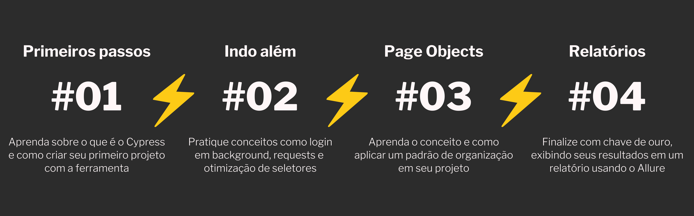

<h1 align="center">Cypress: do zero ao reporte </h1>

Um projeto para aprender sobre o Cypress no Youtube

------------

## TL;TR;
> **Chegou agora e quer ir direto para o código da primeira aula? [Clique aqui](https://github.com/samlucax/youtube-cypress/tree/video1), e depois faça clone do repositório. Bons estudos.**

------------

## Um curso quase gratuito - custa só uma ⭐️ aqui no repositório

O *Cypress: do zero ao reporte* é uma série de vídeos para quem deseja aprender sobre Cypress na prática. Seguindo uma sequência lógica de conteúdos, o projeto vai desde o mais básico que é a criação do projeto, mostrando problemas comuns e propostas de solução, melhorias de arquitetura com padrões de projeto e finalizando com a geração de relatórios para exibir o resultado dos testes. Toda a teoria e eventuais explicações são dadas a medida em que os problemas são resolvidos, sempre em pequenas porções. Todo o conteúdo é muito prático.

Se você quer aprender sobre Cypress, colocar mais um projeto no Portfólio e elevar seus conhecimentos de forma gratuita, #bora.

## Vídeo aulas

O conteúdo dos vídeos é organizado por branches, conforme a lista abaixo:

> ⚡️ **Acesse os vídeos aqui**: [youtube-cypress](https://www.youtube.com/playlist?list=PLnUo-Rbc3jjyx5BVnG8MB7vNd5ecu2yP1 "youtube-cypress")

- [Vídeo 1 - Cypress - passo a passo para criar o primeiro projeto e testes](https://github.com/samlucax/youtube-cypress/tree/video1 "Vídeo 1")
- [Vídeo 2 - Cypress - adicionando mais testes, background login e data-cy](https://github.com/samlucax/youtube-cypress/tree/video2 "Vídeo 2")
- [Vídeo 3 - Cypress - utilizando o Page Objects](https://github.com/samlucax/youtube-cypress/tree/video3 "Vídeo 3")
- [Vídeo 4 - Cypress - adicionando relatório de testes com o Allure Reports Plugin](https://github.com/samlucax/youtube-cypress/tree/video4 "Vídeo 4")

## Resumo dos conteúdos abordados:

- como criar um projeto node
- como adicionar o Cypress ao projeto
- como criar a estrutura de pastas padrão do Cypress
- como executar os testes utilizando o Cypress Runner
- como acessar uma página
- como mapear elementos utilizando Cypress
- como utilizar comandos comuns de digitar, clicar, etc.
- como realizar asserções nos nossos testes
- como criar comandos customizados para auxiliar no desenvolvimento
- como fazer requisições para a api
- como executar testes de forma independente
- como configurar a aplicação testada para executar localmente
- como criar um script para subir o Cypress de forma mais organizada
- como manipular recursos do browser, como o localStorage
- reforçar o padrão de testes independentes
- como criar seletores dedicados para testes
- qual problema o page objects se propõe a resolver
- como criar uma estrutura simples para usar este padrão
- como separar testes, ações e elementos da página

------------

# Passo a passo para configurar o projeto

#### Baixe o projeto no Github, de preferência na branch do Vídeo 1:
- Branch do vídeo 1: `https://github.com/samlucax/youtube-cypress/tree/video1`

#### Instale e suba nossa *cobaia* localmente
1.Acessar o diretório backend, instalar as dependências e iniciar a api:
  - `cd backend` 
  - depois `npm install`
  - depois `npm start`

2.Acessar o diretório frontend, instalar as dependências e iniciar o site:
  - `cd frontend`
  - depois `npm install`
  - depois `npm start`

#### Instale e abra o Cypress
3.Acessar o diretório root do projeto (que tem a pasta Cypress), instalar as dependências e abrir o Cypress Runner:
  - `npm install`
  - `./node_modules/.bin/cypress open`

## Deixe uma ⭐️ e espalhe esse conhecimento para o mundo

Esse treinamento foi feito com muito empenho, carinho e principalmente, pensando em ajudar quem deseja iniciar em automação de testes.
Se este conteúdo ajudou você ou você acredita que pode ajudar alguém #compartilhe esse projeto 🖤

Ah, e deixe uma ⭐️ no repositório para nos apoiar ⚡️#boraagilizar

------------

Ps.:
Se quiser, apague o projeto do Cypress e tente fazer do zero acompanhando o vídeo. Bons estudos!
